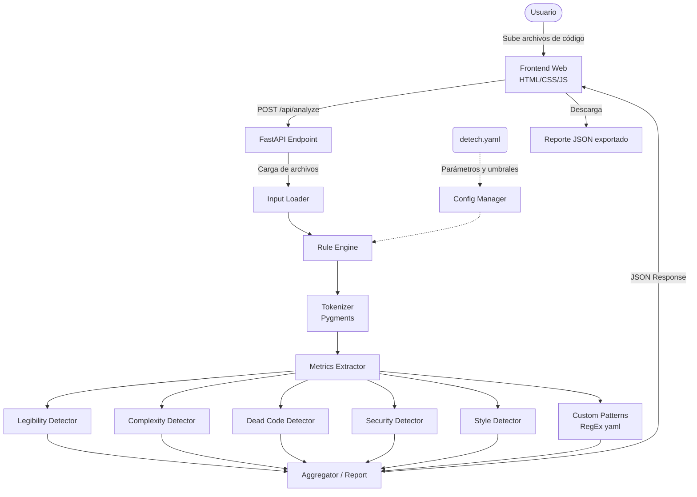

# DETECH — Documentación

## 1. Visión General y Arquitectura

**DETECH** es una herramienta de soporte para programadores enfocada en el análisis estático de código fuente multilenguaje (Python, JavaScript, Go, Rust, entre otros). Su principal objetivo es detectar _anomalías_ (problemas de legibilidad, complejidad excesiva, seguridad, estilo o código muerto) sin necesidad de ejecutar el programa.

### Diagrama de arquitectura



## 2. Ciclo de Vida del Análisis

### Paso a paso:

1. **Carga y lectura**: El módulo `input_loader.py` lee el archivo de código y lo divide en líneas, aceptando cualquier extensión válida.
2. **Tokenización léxica**: En lugar de utilizar un parser AST (Abstract Syntax Tree) que fallaría si el código tiene errores de sintaxis y estaría limitado a un solo lenguaje, utilizamos **Pygments** para inferir dinámicamente el lenguaje y extraer un flujo de tokens estandarizado (palabras clave, nombres, strings, comentarios).
3. **Cálculo de métricas (`metrics.py`)**: Se calculan valores globales del archivo, como las Líneas de Código (LOC), la profundidad máxima de anidamiento (`if` dentro de `if`) y la Complejidad Ciclomática estimada.
4. **Ejecución de detectores (Patrón Strategy)**: El `RuleEngine` orquesta un conjunto de "Detectores" (clases que heredan de `BaseDetector`). A cada detector se le pasan las líneas, los tokens y las métricas. Cada uno devuelve una lista de anomalías.
5. **Reglas personalizadas (`custom_patterns`)**: Luego, el motor aplica expresiones regulares definidas por el usuario en `detech.yaml` sobre las líneas del código.
6. **Agregación y reporte**: Se unifican todas las anomalías y se filtran por severidad en caso el usuario lo solicite, conformando el reporte final.

## 3. Decisiones de Diseño

### ¿Por qué Pygments y métricas heurísticas?

Originalmente se podría usar un módulo AST para un lenguaje específico (ej. `ast` de Python), el cual construye un árbol gramatical perfecto. La desventaja es que si al programador le falta un paréntesis, el analizador falla. Además, los ASTs no son compatibles entre diferentes lenguajes. 
Al usar **Pygments** como motor de análisis léxico transversal, priorizamos la tolerancia a fallos y la adaptabilidad multilenguaje. El sistema mapea cualquier lenguaje soportado por Pygments a un conjunto base de tokens abstractos (`Token`), y las reglas de detección buscan patrones agnósticos (ej. delimitadores de bloque, palabras clave universales de importación o condicionales) para emitir métricas muy precisas.

### Patrón Strategy para detectores

Cada familia de anomalías se agrupa en un archivo diferente (ej. `security.py`). El motor simplemente itera sobre una lista de detectores. Esto facilita inmensamente la escalabilidad del sistema: crear un nuevo detector no rompe el flujo existente.

## 4. Anomalías detectadas

| Categoría         | Código   | Severidad                | Descripción de la Regla                                                                 |
| ----------------- | -------- | ------------------------ | --------------------------------------------------------------------------------------- |
| **Legibilidad**   | `LEG001` | Advertencia              | Función demasiado larga (LOC > umbral).                                                 |
|                   | `LEG002` | Advertencia              | Archivo excesivamente extenso (líneas totales > umbral).                                |
|                   | `LEG003` | Informativo              | Línea de código supera la longitud máxima (ej. 79/120 caracteres).                      |
|                   | `LEG004` | Advertencia              | Indentación inconsistente: mezcla de tabs y espacios en líneas de código.               |
|                   | `LEG005` | Informativo              | Variables con nombres muy cortos (ej. `a = 1`) fuera de bucles.                         |
|                   | `LEG006` | Informativo              | Función sin docstring.                                                                  |
| **Complejidad**   | `CPX001` | Crítico                  | Complejidad Ciclomática alta. Se reporta por función; a nivel de archivo si no hay funciones reconocibles. |
|                   | `CPX002` | Advertencia              | Profundidad de anidamiento elevada.                                                     |
|                   | `CPX003` | Advertencia              | Función con demasiados parámetros.                                                      |
|                   | `CPX004` | Advertencia              | Acoplamiento excesivo: demasiados módulos importados.                                   |
| **Seguridad**     | `SEC001` | Crítico                  | Credenciales o API keys _hardcodeadas_ (con filtro de plausibilidad del valor).         |
|                   | `SEC002` | Crítico (`compile()`: advertencia) | Uso de funciones inseguras como `eval()`, `exec()`, `__import__()`.           |
|                   | `SEC003` | Crítico                  | Posible SQL Injection (concatenación, `%`, `.format()` o f-string interpolada).         |
| **Código Muerto** | `DCO001` | Informativo              | Anotaciones `TODO`, `FIXME`, `HACK`, `XXX` en comentarios.                              |
|                   | `DCO002` | Advertencia              | Bloques de código comentados.                                                           |
|                   | `DCO003` | Advertencia              | Imports no utilizados.                                                                  |
| **Estilo**        | `STY001` | Informativo              | Módulo sin docstring en la cabecera.                                                    |
|                   | `STY002` | Informativo              | Función con nombre en camelCase donde se prefiere snake_case.                           |
| **Sistema**       | `SYS000` | Advertencia              | Error interno de un detector (el análisis del archivo continúa).                        |

Los hallazgos de `SEC001`, `SEC003`, `DCO001`, `DCO002` y los patrones personalizados
se clasifican según su **contexto léxico** (código, comentario o string) usando las
máscaras de línea del tokenizer: una "credencial" dentro de un comentario o un
docstring no se reporta, y una anotación `TODO` solo cuenta si está dentro de un
comentario real.

## 5. Mejoras y personalización

### Modificar umbrales existentes

Para modificar el comportamiento, puedes crear o editar el archivo `detech.yaml` en la raíz del proyecto, ya que el `ConfigManager` fusionará estos valores:

```yaml
thresholds:
  max_function_lines: 30 # Ser más estricto con funciones largas
  max_line_length: 120 # Relajar el largo de línea
  max_parameters: 4 # Limitar parámetros
```

### Añadir reglas rápidas con Regex

Puedes añadir reglas personalizadas sin tocar código Python, editando el archivo `detech.yaml`:

```yaml
custom_patterns:
  - id: CUS001
    name: "Uso de print en producción"
    pattern: "print\\("
    severity: "warning"
    message: "No usar print(), usar logging.info()."
    scope: "code" # opcional: code (default) | comment | all
```

La clave opcional `scope` controla el contexto léxico donde aplica el patrón:
`code` (default) ignora coincidencias dentro de comentarios y strings; `comment`
solo busca dentro de comentarios (útil para políticas sobre anotaciones); `all`
no filtra por contexto.

### Crear un nuevo detector Python

Si la regla requiere contexto (por ejemplo, buscar llamadas a un ORM específico), crea una clase nueva en la carpeta `app/detectors/`.

1. Crea el archivo `app/detectors/performance.py`.
2. Hereda de `BaseDetector` y sobreescribe `detect()`.
3. Registra tu clase en `app/core/rule_engine.py` dentro de `self._detectors = [...]`.

```python
from typing import List
from ..core.models import Anomaly
from .base import BaseDetector

class PerformanceDetector(BaseDetector):
    def detect(self, filepath: str, lines: List[str], tokens: List, metrics: dict) -> List[Anomaly]:
        anomalies = []
        for i, line in enumerate(lines, 1):
            if "time.sleep" in line:
                anomalies.append(Anomaly(filepath, i, "PERF001", "performance", "warning", "Uso de sleep detectado", line.strip()))
        return anomalies
```

## 6. Limitaciones conocidas

DETECH trabaja exclusivamente sobre el flujo de tokens léxicos y expresiones
regulares (por restricción de diseño: sin AST y sin ejecutar el código). Eso
implica límites que conviene conocer al interpretar un reporte:

- **Sin análisis de flujo de datos ni resolución de alcance.** La herramienta
  no sabe si una variable se sobrescribe, si un nombre está _shadowed_ o si un
  valor viaja entre funciones. Por ejemplo, `DCO003` (import no utilizado)
  compara nombres textualmente: un `import numpy as np` se reporta como no
  usado aunque `np` aparezca, porque el alias no se resuelve.
- **La complejidad ciclomática es una estimación léxica.** Se calcula como
  1 + puntos de decisión (`if`, `elif`, `for`, `while`, `case`, `except`,
  `catch`, `switch`, `do`, `loop`) + operadores de cortocircuito (`and`, `or`,
  `&&`, `||`) contados sobre los tokens. Puede diferir del McCabe exacto que
  daría un grafo de control de flujo construido desde un AST.
- **El fin de una función se detecta por heurística**, no por gramática:
  balance de llaves en lenguajes con `{}` y dedent en Python. En lenguajes
  donde la declaración de función no tiene palabra clave (C: `int main(...)`),
  las funciones no se reconocen, y métricas como `CPX001` se reportan a nivel
  de archivo en lugar de por función.
- **`SEC001` usa un filtro de plausibilidad sobre el valor**: un valor de
  menos de 8 caracteres puramente alfabético no se reporta (evita falsos
  positivos como `NAME_TOKEN = "NAME"`), a costa de callar contraseñas cortas
  alfabéticas como `password = "hunter"`. Los nombres compuestos
  (`db_password`, `PaymentGatewayToken`) sí se detectan por sufijo.
- **`SEC003` descarta solo coincidencias dentro de comentarios, no de
  strings**: una inyección real puede vivir íntegramente dentro del literal
  (`sprintf(query, "... '%s'", buf)` o una f-string interpolada). Un string
  SQL inofensivo no se reporta porque los patrones exigen un operador de
  concatenación o formato.
- **`DCO001` y `DCO002` solo consideran comentarios reales**: un `TODO`
  dentro de un string es dato, y un docstring con código de ejemplo no es un
  bloque de código comentado.
- **El análisis estadístico entre archivos (outliers de un lote) no está
  implementado**; figura en las especificaciones como fase futura.
